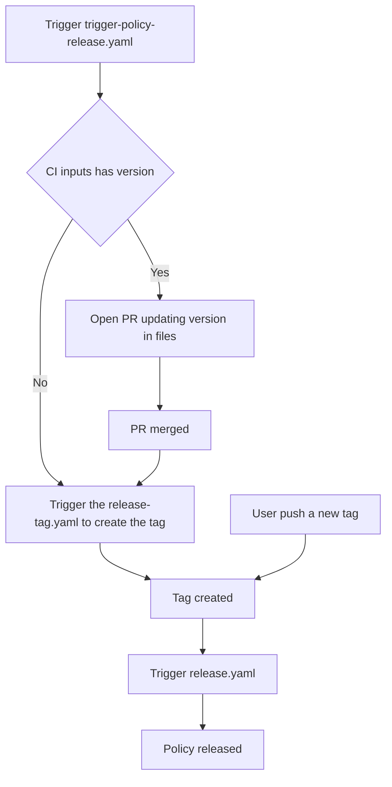

# Contributing to Kubewarden Policies

Thank you for your interest in contributing! This document outlines the
technical workflow for developing, testing, and releasing policies within this
repository.

Kubewarden is language-agnostic. This repository contains policies written in
Rust, Go and Rego.

# Directory Structure

This repository is a monorepo. While each policy is functionally independent,
they share common tooling and dependencies.

```text
.
├── policies/ # Policy source code
│ ├── Cargo.toml # Rust Workspace configuration
│ ├── Cargo.lock # Shared dependency lock file for Rust
│ ├── Makefile.p-rego # Shared build rules of the Rego policies
│ ├── <policy-name>/ # Specific policy directory
│ │ ├── src/ # Source code
│ │ ├── test_data/ # Files for testing
│ │ ├── Makefile # Standardized build commands
│ │ ├── metadata.yml# Artifact Hub metadata
│ │ ├── <any other policy file>
│ ├── <policy-name>/ # Specific policy directory
│ │ ├── <any other policy file>
├── staging/ # Rego policies that are not ready for release
│ ├── <policy-name>/ # Specific policy directory
```

# Rego Policies

Rego policies have Rego unit tests files in two layouts, the `Makefile.p-rego`
supports both:
- in `policy_test.rego` next to `policy.rego`
- one or more files under `tests/`

The `e2e-tests` target runs `bats e2e.bats` when the policy has that file, and
it builds the annotated Wasm module only when it does not.

# The staging Directory

The `staging/` directory holds Rego policies that are not ready for release.
The CI ignores this directory. It calculates the policy matrix from `policies/`
only, so a change under `staging/` starts no build, no test and no release.

To promote a policy, move its directory to `policies/`, add the `Makefile`
symbolic link to `../Makefile.p-rego`, and add a
`.github/release-drafter-<policy-name>.yml` file with:

```console
go run hack/release-drafter-config-generator.go \
    --policy-name <policy-name> \
    --output .github/release-drafter-<policy-name>.yml
```

# Rust Workspace

To optimize build times and ensure consistency, all Rust policies are members
of a single Rust Workspace. The `policies/Cargo.toml` defines the workspace
members. Common dependencies are shared across policies to reduce maintenance
overhead. When adding a new Rust policy, ensure it is added to the members list
in the root Cargo.toml.

# How to Build Policies

We use `make` to provide a consistent interface across different programming
languages.

Navigate to the policy directory:

```console
cd policies/policy-name
```

Build the Wasm binary:

```console
    make policy.wasm
```

# How to Test Policies

All policies in this repository should provide unit test and integration tests.
To run all the tests run the following command:

```console
make test e2e-tests
```

## Language-Scoped Makefile Targets

The root `Makefile` provides targets that operate across all policies
regardless of language (`test`, `lint`, `e2e-tests`). For faster iteration,
language-scoped variants are also available.

| Target           | Scope                                                                             |
| ---------------- | --------------------------------------------------------------------------------- |
| `test-rust`      | Rust policies (detected by `Cargo.toml`) + shared crates under `policies/crates/` |
| `test-go`        | Go policies (detected by `go.mod`)                                                |
| `lint-rust`      | Rust policies + shared crates under `policies/crates/`                            |
| `lint-go`        | Go policies                                                                       |
| `e2e-tests-rust` | Rust policies                                                                     |
| `e2e-tests-go`   | Go policies                                                                       |

The language detection is file-based: a policy directory is considered Rust if
it contains a `Cargo.toml`, and Go if it contains a `go.mod`. These sets are
mutually exclusive. The shared crates under `policies/crates/` are all Rust and
are included in the `*-rust` targets for `test` and `lint` (consistent with the
full-repo targets), but not for `e2e-tests` since crates have no end-to-end
tests.

# How to Release a Policy

The release process is fully automated via CI/CD to ensure consistency and
provenance. This repository has CI that automate the task of bumping policy
version in all places required. This is done by the
`.github/workflows/trigger-policy-release.yml`. When this CI is run users can
define the next version to be released like this:

```console
gh workflow run trigger-policy-release.yaml \
    -f "policy-working-dir=allowed-proc-mount-types-psp-policy" \
    -f "policy-version=1.0.6" \
    -R kubewarden/policies
```

> [!IMPORTANT]
> The `policy-working-dir` must be the name of the directory under the
> `policies` directory

In this scenario, the CI will open a PR bumping the version in all required
files. Once this PR is merged another CI will detect the release, create the
tag and continue the release process.

However, if you already bump the version, you can omit the `policy-version`
field:

```
gh workflow run trigger-policy-release.yaml \
    -f "policy-working-dir=allowed-proc-mount-types-psp-policy" \
    -R kubewarden/policies
```

Therefore, the CI will skip the PR to update the files and go strait to tagging
the release the policy artifacts.

> [!NOTE]
> The `trigger-policy-release.yaml` CI can also be trigged in the Github UI.

The release CI flow is something like this:



## Publish the 'latest' tag of one policy

You can also run `release.yml` manually, against a branch. That run builds one
policy and publishes it with the `:latest` tag:

```console
gh workflow run release.yml \
    -f "policy-working-dir=allowed-proc-mount-types-psp-policy" \
    -R kubewarden/policies
```

The version comes from the `io.kubewarden.policy.version` annotation of
`metadata.yml`. A run against a branch only pushes the `:latest` OCI tag. It
creates no git tag and no GitHub release. It updates neither ArtifactHub nor
the policy catalog.

> [!NOTE]
> A run of `release.yml` against a tag is a normal release. The policy name
> and the version come from the tag name, and the run ignores the
> `policy-working-dir` input.
>
> `release-tag.yaml` starts this kind of run. GitHub fires no workflow for a
> tag pushed with `GITHUB_TOKEN`, so `release-tag.yaml` must start the run
> itself, with `gh workflow run release.yml --ref <tag>`.

# Tag Pattern

The CI creates tags using the following logic based on the subdirectory under
the `policies` directory modified:

```
<policy-subdirectory-name>/v<semantic-version>`
```

Example: If you update the `pod-privileged-policy` policy to version `0.1.5`,
the CI will generate the tag: `pod-privileged-policy/v0.1.5`

# OCI Namespaces

Each policy declares its OCI URL in the `io.kubewarden.policy.ociUrl` annotation
of `metadata.yml`. All policies of this repository use the `policies` namespace:

```
ghcr.io/kubewarden/policies/<policy-name>
```

The CI reads only the last segment of the annotation, `<policy-name>`.
The CI then builds the OCI URL from a base and the `POLICIES_OCI_BASE`
repository variable:

```bash
<POLICIES_OCI_BASE>/<policy-name>
```

When `POLICIES_OCI_BASE` is empty, the base is
`ghcr.io/<repository-owner>/policies`.

Therefore:

- The registry and the namespace of the annotation have no effect. Keep them at
  `ghcr.io/kubewarden/policies` so that the annotation shows the true location
  of the policy of the upstream repository.
- Upstream repository publishes to `ghcr.io/kubewarden/policies`
- A fork publishes to its own registry. It never publishes to `kubewarden`.

To keep the annotation and the push target in agreement, the CI stops with an
error when:

- the annotation is absent, or
- the namespace of the annotation is not `policies`.

The `set-policy-oci-url` action then writes the calculated URL into the
annotation of the checked out `metadata.yml`. The action does not commit this
change. It runs in the `release` job before `kwctl annotate`, and in the
`push-artifacthub` job before `kwctl scaffold artifacthub`.

> [!IMPORTANT]
> `kwctl annotate` writes the annotation into the Wasm module, `kwctl push`
> uses it as the push target, and `kwctl scaffold artifacthub` writes it into
> `artifacthub-pkg.yml`. All three read the same value, so the URL that
> ArtifactHub shows is the URL from which users can pull the policy.

## The OCI tests/ namespace

The `ghcr.io/kubewarden/tests/<policy-name>` namespace is reserved for manual
pushes. The CI never writes to it. The policies in this namespace are used by
integration tests and the like.

# Forks

A fork releases the policies to its own registry. It does not need a change of
the files that this repository tracks. Thus a fork stays easy to synchronize
with the upstream repository.

## Forks on GitHub

A fork on GitHub needs no configuration. The CI publishes to
`ghcr.io/<repository-owner>/policies/<policy-name>` with the token of the
workflow.

## Forks that use another registry

Give the fork one repository variable and two repository secrets:

| Name                    | Type     | Example                                |
| ----------------------- | -------- | -------------------------------------- |
| `POLICIES_OCI_BASE`     | variable | `registry.example.com/team/policies`   |
| `POLICIES_OCI_USERNAME` | secret   | `robot$policies`                       |
| `POLICIES_OCI_PASSWORD` | secret   | the password or the token of that user |

The value of `POLICIES_OCI_BASE` is the registry, the organization and the
namespace, without the name of the policy. The CI adds the name of the policy
and the tag.

When `POLICIES_OCI_BASE` is empty, the CI ignores the two secrets and it logs
in to GHCR with the token of the workflow.

## What a fork must know

- The `io.kubewarden.policy.url` and `io.kubewarden.policy.source` annotations
  still point to the upstream repository. Therefore the link to the GitHub
  release in `artifacthub-pkg.yml` also points to the upstream repository.
- The `push-artifacthub` job runs on a fork. It writes to the `artifacthub`
  branch of the fork only.
- The `release-catalog` job runs on the upstream repository only.

## Signatures on a fork

`cosign` signs the policies of a fork with the GitHub Actions identity of that
fork. Three results come from this:

- The signature goes to the registry of the fork, next to the policy.
- The certificate comes from the public Fulcio, and the entry goes to the
  public Rekor. The digest of the policy and the name of the fork become
  public, also when the registry is private.
- Users must verify with the identity of the fork:

```console
cosign verify \
  --certificate-identity-regexp 'https://github.com/<owner>/<repo>/.github/workflows/release.yml@.*' \
  --certificate-oidc-issuer https://token.actions.githubusercontent.com \
  <base>/<policy-name>:<tag>
```
